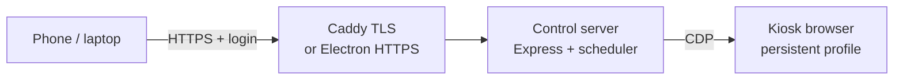

# AGENTS.md

Developer guide for humans and coding agents working in this repo. Read this
before changing behavior.

---

## What this is

A kiosk that drives the **Planning Center Services live/countdown page** on a
wall TV. Operators pick the active service from a control panel on the same
network. The TV tab is navigated via the **Chrome DevTools Protocol (CDP)** —
not an iframe (PCO sends `X-Frame-Options` / CSP that would block embedding).

| Platform | Packaging |
| --- | --- |
| Debian/Ubuntu Linux | systemd + lightdm + Caddy |
| NixOS | Flake module + Cage/Wayland |
| Windows | Single-file Electron app |
| macOS | launchd |

Core is Node + any Chromium-based browser over CDP. See
[docs/PLATFORMS.md](docs/PLATFORMS.md).

---

## Architecture



| Path | Role |
| --- | --- |
| `server/` | Express control server — heart of the app |
| `public/` | Control-panel UI (vanilla JS, no build step) |
| `kiosk/` | Launchers, installers, helpers |
| `app/` | Windows Electron shell (`main.js`: server in-process + tray + kiosk window) |
| `.github/workflows/` | `ci.yml` (test, Nix check, Windows build, tarball); `release.yml` on *published* releases |

### `kiosk/` helpers

| File | Purpose |
| --- | --- |
| `launch-kiosk.js` | Cross-platform Chromium/Edge launcher (`window` / `--kiosk` / `--login`) |
| `launch-kiosk.sh` | Thin bash wrapper that `exec`s the JS launcher |
| `run.js` | Supervisor (server + Caddy + browser) for Windows/macOS — not used on Linux |
| `gen-cert.js` | Self-signed cert (`selfsigned` is **async**); skips if certs exist unless `--force` |
| `setup.js` | TLS-only Caddy config (macOS) |
| `install.sh` / `install-macos.sh` / `installer/windows/` | Per-platform packaging |
| `lightdm/` | Raspberry Pi OS Lite headless autologin session |

---

## Key concepts

- **CDP driving** (`server/kiosk.js` · `KioskDriver`) — connects via
  `chrome-remote-interface`, reconnects on crash, same-URL guard on
  `navigate()`. Display-type/theme setters briefly emulate a desktop viewport
  (PCO live-controller DOM only renders there), click, then restore. Black
  loading background via `Page.addScriptToEvaluateOnNewDocument` (plus
  `--blink-settings` / `--force-dark-mode` for browser chrome).
- **Remote control** (`/api/remote/*`) — JPEG screencast over SSE; taps/keys
  via `Input`. How one-time PCO login is done from the panel.
- **Scheduler** (`server/scheduler.js`) — CEC auto-on before next
  service/rehearsal; daily reboot via `cron-parser` (platform-aware reboot
  command).
- **PCO importer** (`server/pco.js`) — Services v2 API, read-only. Bearer PAT
  or Basic `app_id:secret`. `KIOSK_PCO_API_BASE` for tests.

---

## Authentication

Auth lives **inside the app** on every platform (no Caddy `basic_auth`).
`server/auth.js`:

- Cookie sessions (`kiosk_session`, HttpOnly, SameSite=Lax, Secure on HTTPS;
  server-side token Map).
- First-run setup: `GET /api/auth/status` → `{ authenticated, setupRequired }`;
  `POST /api/auth/setup` then normal login/logout.
- Credentials in `config.json` as `admin: { username, passwordHash }`
  (bcrypt). `GET /api/state` exposes only `adminConfigured`.
- `requireAuth` mounts **after** `/api/auth/*`, so auth routes are public.
- **Loopback always allowed** (kiosk window). For a loopback peer,
  `clientAddress` uses the **rightmost** `X-Forwarded-For` entry (what Caddy
  appended) so LAN clients through the proxy are never mistaken for
  loopback. Direct non-loopback peers (Windows HTTPS) never consult
  `X-Forwarded-For`.
- Linux/macOS: Caddy is TLS-only → `127.0.0.1:3001`. Windows: HTTPS on
  `0.0.0.0:443` (`KIOSK_TLS=1`) + HTTP on `127.0.0.1:3001` for the kiosk
  window.
- `app.set('trust proxy', 1)` so `req.secure` reflects TLS behind Caddy.

> [!IMPORTANT]
> New `/api/*` routes are automatically behind `requireAuth` (loopback
> exempt). Public endpoints go under `/api/auth/` or register **before** the
> middleware. Deliberate exception: `GET /api/update/progress` (registered
> early) so the panel can poll across a server restart that wipes sessions —
> it only exposes update state.

---

## Config (`config.json`)

`KIOSK_CONFIG` (default `./config.json`; Electron:
`%APPDATA%\Planning Center Kiosk\config.json`):

```json
{
  "urlTemplate": "https://services.planningcenteronline.com/live/{serviceId}",
  "activeServiceId": null,
  "defaultDisplayType": null,
  "defaultTheme": null,
  "tv": { "autoOn": false, "leadMinutes": 30 },
  "reboot": { "cron": null },
  "admin": { "username": null, "passwordHash": null },
  "update": { "includePrereleases": false },
  "services": [{ "id": "", "name": "", "serviceId": "", "displayType": "", "serviceTypeId": null }],
  "pco": { "apiKey": null }
}
```

When adding a field: update `defaults()` **and** `normalize()` in
`server/config.js`. Saves are atomic (`.tmp` + rename). URL tokens via
`server/url.js`: `{serviceId}`, `{displayType}`.

Versions are date-based (`YYYY.M.D` / `YYYY.M.D-beta`) in root +
`app/package.json`. Updater uses `/releases/latest` unless
`includePrereleases` is on. `release.yml` attaches Windows artifacts + source
tarball when a release is published.

---

## Commands

```bash
npm install          # use --include=dev if NODE_ENV=production omits devDeps
npm start            # http://127.0.0.1:3001
npm run kiosk        # kiosk browser at the idle page
npm test             # node --test (mock CDP + mock PCO; no network)
```

---

## Tests

`test/` uses `node:test` only — never a real browser or network:

| Helper | Role |
| --- | --- |
| `helpers/mock-cdp.js` | Fake CDP HTTP + WebSocket for `KioskDriver` |
| `helpers/mock-pco.js` | Fake Planning Center API |
| `createApp()` | Injectable `kiosk` / `cec` / `logger`; `runScheduler` false in tests |

Tests hit `127.0.0.1` (loopback-exempt). Auth is covered in `test/auth.test.js`
and `test/auth-api.test.js`. Add tests with new routes/features.

---

## Sharp edges

- `selfsigned` v5 is **async** (`await selfsigned.generate(...)`).
- `gen-cert.js` skips regeneration when certs exist (phones keep trusting
  them). Pass `--force` to rotate.
- Sessions expire after 24h, wipe on password change, and die on server
  restart (in-memory).
- Navigation allowlisted to PCO hosts (+ local idle URL);
  `/api/remote/start` always opens the hard-coded PCO login URL.
- Version strings must match in root `package.json`, `app/package.json`, and
  `installer/windows/kiosk.iss` (`MyAppVersion`). CI enforces via
  `.github/scripts/check-versions.js`.
- Auth middleware on the HTTPS path must use raw Node
  (`res.setHeader` / `res.statusCode`), not Express `res.set()` /
  `res.status()`.
- Windows kiosk profile must **never** be created elevated — admin-owned
  profile → Edge exits → restart loop. Electron + installer stay
  non-elevated.
- Electron data folder name comes from
  `app.setName('Planning Center Kiosk')` in `app/main.js`.
- electron-builder needs symlink privilege on a local Windows box (Developer
  Mode); GHA runners are fine. `build-windows.ps1` uses `npm ci` when
  `app/package-lock.json` exists.

---

## Packaging quick reference

| Platform | Entry |
| --- | --- |
| **Linux** | `sudo ./kiosk/install.sh` — packages, lightdm session, unprivileged control user, TLS-only Caddy, optional Tailscale. Units use `@DEST@` / `@NODE_BIN@` / … placeholders resolved by install. |
| **NixOS** | `nix/` module `services.planningcenter-timer-kiosk` — pin a release tag, `nixos-rebuild switch`. |
| **Windows** | `installer/windows/build-windows.ps1` — bundles into `app/`, electron-builder portable exe, Inno Setup wrapper. |
| **macOS** | `kiosk/install-macos.sh` — Homebrew Node/Caddy + launchd + panel app. |
