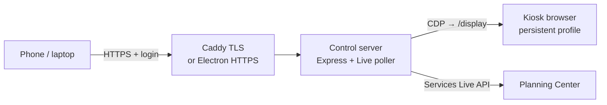

# AGENTS.md

Developer guide for humans and coding agents working in this repo. Read this
before changing behavior.

This tree is the **API-driven countdown** flavor: the TV shows a local
`/display` page fed by the Planning Center Services Live API. The operator
runs LIVE from their phone; the kiosk browser only views.

---

## What this is

A wall-TV countdown kiosk for Planning Center Services. Operators pick the
active plan from a control panel on the same network. The TV browser is driven
via the **Chrome DevTools Protocol (CDP)** to a local display page.

| Platform | Packaging |
| --- | --- |
| Debian/Ubuntu Linux | systemd + lightdm + Caddy |
| NixOS | Flake module + Cage/Wayland |
| Windows | Single-file Electron app |
| macOS | launchd |

Core is Node + any Chromium-based browser over CDP. See
[docs/PLATFORMS.md](docs/PLATFORMS.md).

---

## Architecture



| Path | Role |
| --- | --- |
| `server/` | Express control server — heart of the app |
| `panel/` | Control-panel source (Vite + React + TypeScript); builds into `public/` |
| `public/` | Built panel assets plus the TV pages (`display.*`, idle) |
| `kiosk/` | Launchers, installers, helpers |
| `app/` | Windows Electron shell (`main.js`: server in-process + tray + kiosk window) |
| `.github/workflows/` | `ci.yml` (test, Nix check, Windows build, tarball); `release.yml` on *published* releases |

### `kiosk/` helpers

| File | Purpose |
| --- | --- |
| `launch-kiosk.js` | Cross-platform Chromium/Edge launcher (`window` / `--kiosk` / `--login`) |
| `launch-kiosk.sh` | Thin bash wrapper that `exec`s the JS launcher |
| `run.js` | Supervisor (server + Caddy + browser) for Windows/macOS — Linux uses systemd |
| `gen-cert.js` | Self-signed cert (`selfsigned` is **async**); skips if certs exist unless `--force` |
| `setup.js` | TLS-only Caddy config (macOS) |
| `install.sh` / `install-macos.sh` / `installer/windows/` | Per-platform packaging |
| `lightdm/` | Raspberry Pi OS Lite headless autologin session |

---

## Key concepts

- **Local display** (`public/display.*` · `GET /display`) — Countdown Full–style
  dark page. Item remaining/overtime from Live API; pre-service countdown from
  plan times. Client interpolates between ~1s server polls.
- **Live poller** (`server/live-display.js`) — polls Services Live for the
  active plan; SSE hub at `GET /api/display/stream`; snapshot at
  `GET /api/display/state`.
- **CDP driving** (`server/kiosk.js` · `KioskDriver`) — connects via
  `chrome-remote-interface`, reconnects on crash, same-URL guard on
  `navigate()`. On select, navigates to local `/display` (loopback).
- **Scheduler** (`server/scheduler.js`) — CEC auto-on before next
  service/rehearsal; daily reboot via `cron-parser` (platform-aware reboot
  command).
- **PCO client** (`server/pco.js`) — Services v2 + Live API. Bearer PAT or
  Basic `app_id:secret`. Key from `KIOSK_PCO_API_KEY` (or repo `.env` loaded at
  start) then `config.pco.apiKey`. `KIOSK_PCO_API_BASE` for tests.

---

## Authentication

Auth lives **inside the app** on every platform. `server/auth.js`:

- Cookie sessions (`kiosk_session`, HttpOnly, SameSite=Lax, Secure on HTTPS;
  server-side token Map).
- First-run setup: `GET /api/auth/status` → `{ authenticated, setupRequired }`;
  `POST /api/auth/setup` then normal login/logout.
- Credentials in `config.json` as `admin: { username, passwordHash }`
  (bcrypt). `GET /api/state` exposes only `adminConfigured`.
- `requireAuth` mounts **after** `/api/auth/*`, so auth routes are public.
- **Loopback always allowed** (kiosk window). For a loopback peer,
  `clientAddress` uses the **rightmost** `X-Forwarded-For` entry (what Caddy
  appended) so LAN clients through the proxy authenticate. Direct
  non-loopback peers (Windows HTTPS) never consult `X-Forwarded-For`.
- Linux/macOS: Caddy is TLS-only → `127.0.0.1:3001`. Windows: HTTPS on
  `0.0.0.0:443` (`KIOSK_TLS=1`) + HTTP on `127.0.0.1:3001` for the kiosk
  window.
- `app.set('trust proxy', 1)` so `req.secure` reflects TLS behind Caddy.

> [!IMPORTANT]
> New `/api/*` routes are automatically behind `requireAuth` (loopback
> exempt). Public endpoints go under `/api/auth/` or register **before** the
> middleware. Deliberate exception: `GET /api/update/progress` (registered
> early) so the panel can poll across a server restart that wipes sessions —
> it only exposes update state.

---

## Config (`config.json`)

`KIOSK_CONFIG` (default `./config.json`; Electron:
`%APPDATA%\Planning Center Kiosk\config.json`):

```json
{
  "activeServiceId": null,
  "defaultDisplayType": null,
  "defaultTheme": null,
  "tv": { "autoOn": false, "leadMinutes": 30 },
  "reboot": { "cron": null },
  "admin": { "username": null, "passwordHash": null },
  "update": { "includePrereleases": false },
  "services": [{ "id": "", "name": "", "serviceId": "", "displayType": "", "serviceTypeId": null }],
  "pco": { "apiKey": null }
}
```

When adding a field: update `defaults()` **and** `normalize()` in
`server/config.js`. Saves are atomic (`.tmp` + rename).

`server/index.js` loads a repo-root `.env` (if present) without overriding
existing environment variables — useful for `KIOSK_PCO_API_KEY` in development.

Versions are date-based (`YYYY.M.D` / `YYYY.M.D-beta`) in root +
`app/package.json`. Updater uses `/releases/latest` unless
`includePrereleases` is on. `release.yml` attaches Windows artifacts + source
tarball when a release is published.

---

## Commands

```bash
npm install --include=dev   # if NODE_ENV=production omits devDeps
npm run build:panel         # Vite build → public/
npm start                   # http://127.0.0.1:3001
npm run kiosk               # kiosk browser at the idle page
npm run dev:panel           # Vite dev server (proxies /api → :3001)
npm test                    # node --test (mock CDP + mock PCO)
```

---

## Tests

`test/` uses `node:test` only — mock CDP/PCO, no live network:

| Helper | Role |
| --- | --- |
| `helpers/mock-cdp.js` | Fake CDP HTTP + WebSocket for `KioskDriver` |
| `helpers/mock-pco.js` | Fake Planning Center API (including Live) |
| `createApp()` | Injectable `kiosk` / `cec` / `logger`; `runScheduler` false in tests |

Tests hit `127.0.0.1` (loopback-exempt). Auth is covered in `test/auth.test.js`
and `test/auth-api.test.js`. Live display math in `test/live-display.test.js`.
Add tests with new routes/features.

---

## Sharp edges

- `selfsigned` v5 is **async** (`await selfsigned.generate(...)`).
- `gen-cert.js` skips regeneration when certs exist (phones keep trusting
  them). Pass `--force` to rotate.
- Sessions expire after 24h, wipe on password change (`destroyAllSessions`),
  and die on server restart (in-memory).
- Kiosk navigation is allowlisted (`server/url-allowlist.js`): PCO hosts,
  local `/nowplaying`, and local `/display`. Remote start always opens the
  hard-coded PCO login URL.
- Selecting a plan re-resolves `serviceTypeId` before Live polls (stale type
  IDs return 404 from PCO).
- CDP mutations that navigate go through `kiosk.runExclusive()` so select /
  deselect / remote-start cannot interleave.
- Panel build uses `emptyOutDir: false` so `public/display.*` survives Vite.
- Version strings must match in root `package.json`, `app/package.json`, and
  `installer/windows/kiosk.iss` (`MyAppVersion`). CI enforces via
  `.github/scripts/check-versions.js`.
- Auth middleware on the HTTPS path must use raw Node
  (`res.setHeader` / `res.statusCode`), not Express `res.set()` /
  `res.status()`.
- Windows kiosk profile must **never** be created elevated — admin-owned
  profile → Edge exits → restart loop. Electron + installer stay
  non-elevated.
- Electron data folder name comes from
  `app.setName('Planning Center Kiosk')` in `app/main.js`.
- electron-builder needs symlink privilege on a local Windows box (Developer
  Mode); GHA runners are fine. `build-windows.ps1` uses `npm ci` when
  `app/package-lock.json` exists.

---

## Packaging quick reference

| Platform | Entry |
| --- | --- |
| **Linux** | `sudo ./kiosk/install.sh` — packages, lightdm session, unprivileged control user, TLS-only Caddy, optional Tailscale. Builds the React panel when `panel/` is present. Units use `@DEST@` / `@NODE_BIN@` / … placeholders resolved by install. |
| **NixOS** | `nix/` module `services.planningcenter-timer-kiosk` — pin a release tag, `nixos-rebuild switch`. Builds via `npmBuildScript = "build:panel"`. |
| **Windows** | `installer/windows/build-windows.ps1` — builds panel, bundles into `app/`, electron-builder portable exe, Inno Setup wrapper. |
| **macOS** | `kiosk/install-macos.sh` — Homebrew Node/Caddy + launchd + panel app. |
