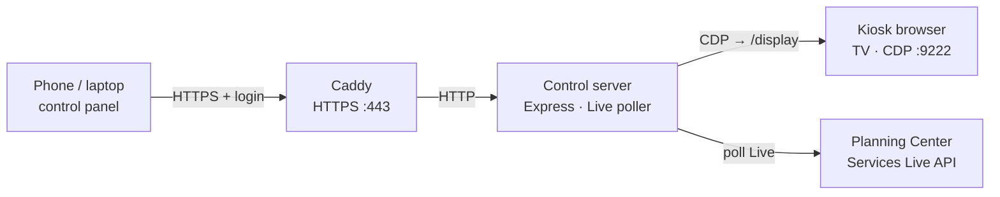

# Planning Center Countdown Kiosk

[](https://github.com/Paperboypaddy/Planning-Center-Timer-Kiosk/actions/workflows/ci.yml)
[](LICENSE)
[](https://nodejs.org/)

API-driven countdown for Planning Center Services on a wall TV. Operators
select the active plan from a phone or laptop on the same network. The TV
shows a local Countdown Full–style page fed by the Services Live API while
someone runs LIVE from their phone.

**Platforms:** Linux (Debian/Ubuntu, Raspberry Pi, Orange Pi, x86 Mini PCs),
[NixOS](docs/PLATFORMS.md#nixos-declarative-cagewayland), Windows, and macOS.
See [docs/PLATFORMS.md](docs/PLATFORMS.md) for setup and feature differences.

---

## How it works



> [!NOTE]
> On Windows the Electron app serves HTTPS itself (Caddy is Linux/macOS). The
> TV tab is a real browser navigation to the local `/display` page, driven
> over the Chrome DevTools Protocol.

| Piece | Role |
| --- | --- |
| **Control server** (`server/`) | Config, plan selection, Live poller, CDP |
| **Control panel** (`panel/` → `public/`) | React UI — pick plans, API key, TV/Wi‑Fi/reboot |
| **TV display** (`/display`) | Local countdown clock (item + scheduled modes) |
| **Kiosk launcher** (`kiosk/`) | Chromium/Edge with a persistent profile |
| **Idle page** (`/nowplaying`) | What the TV shows when nothing is selected |

### Operator workflow

1. Connect a Planning Center API key (personal access token or `app_id:secret`).
2. Import or add plans in the panel.
3. An operator starts **LIVE** on their phone in Planning Center Services.
4. Tap a plan in the panel — the TV navigates to `/display` and follows Live.

---

## Quick start (development)

Requires Node.js ≥ 18 and a Chromium-based browser.

```bash
npm install --include=dev
npm run build:panel
npm start                 # http://127.0.0.1:3001
npm test
```

Optional: put `KIOSK_PCO_API_KEY=…` in a repo-root `.env` (loaded automatically
on server start) or export it in the shell.

Simulate the kiosk in another terminal:

```bash
chromium --remote-debugging-port=9222 \
  --user-data-dir="$HOME/.config/kiosk-chromium" \
  http://127.0.0.1:3001/nowplaying
```

Add a plan in the panel, tap it, and the kiosk opens
`http://127.0.0.1:3001/display`.

Panel UI development (proxies `/api` to the control server):

```bash
npm start                 # terminal 1
npm run dev:panel         # terminal 2
```

---

## Install on a device

| Platform | Command / build |
| --- | --- |
| **Linux** | `sudo ./kiosk/install.sh` |
| **NixOS** | Flake module — see [PLATFORMS.md](docs/PLATFORMS.md#nixos-declarative-cagewayland) |
| **Windows** | `installer\windows\build-windows.ps1` → portable exe + installer |
| **macOS** | `./kiosk/install-macos.sh` |

Full walkthrough: **[docs/SETUP.md](docs/SETUP.md)** · platform matrix:
**[docs/PLATFORMS.md](docs/PLATFORMS.md)** · pilot checklist:
**[docs/DEPLOYMENT.md](docs/DEPLOYMENT.md)**

After install: create the admin account on first panel visit, add an API key,
then import or add plans.

---

## Features

### Local countdown display

When a plan is selected, the kiosk shows `/display`:

- **Item mode** — remaining time / overtime from Live (`live_end_at`, or
  start + planned length)
- **Scheduled mode** — countdown to (or past) the next service start
- **End-on-time** caption from projected plan end

Display defaults (layout/theme labels in settings) remain available for future
UI variants; the shipped page is Countdown Full dark.

### TV power, auto-on, reboot

On Linux with HDMI-CEC (`cec-utils`):

- Manual TV on / off / status from the panel
- **Auto-on** before the next service or rehearsal (needs a PCO API key)
- **Reboot schedule** via presets or a 5-field cron expression

### Wi-Fi (Raspberry Pi)

Scan and connect from the panel when NetworkManager (`nmcli`) is available.
Passwords go straight to NetworkManager.

### Import from Planning Center

Connect a read-only personal access token (or `app_id:secret`) and pull
upcoming plans into the service list.

<details>
<summary><strong>Configuration & environment</strong></summary>

Config lives in one JSON file (`KIOSK_CONFIG`, default `./config.json`; under
systemd: `/var/lib/kiosk/config.json`):

```json
{
  "activeServiceId": null,
  "defaultDisplayType": null,
  "defaultTheme": null,
  "tv": { "autoOn": false, "leadMinutes": 30 },
  "reboot": { "cron": null },
  "services": [
    { "id": "…", "name": "Sunday 9am", "serviceId": "90197325", "displayType": "", "serviceTypeId": "…" }
  ],
  "pco": { "apiKey": null }
}
```

| Env var | Default | Purpose |
| --- | --- | --- |
| `KIOSK_PORT` | `3001` | Control-server port (localhost) |
| `KIOSK_PANEL_PORT` | `443` | HTTPS panel port (Caddy / installers) |
| `KIOSK_CONFIG` | `./config.json` | Config file path |
| `KIOSK_CDP_HOST` | `127.0.0.1` | Chromium CDP host |
| `KIOSK_CDP_PORT` | `9222` | Chromium remote-debugging port |
| `KIOSK_PCO_API_KEY` | — | PCO token; preferred over config-file key |

A repo-root `.env` is loaded on start when present (existing env vars win).

</details>

<details>
<summary><strong>REST API</strong></summary>

| Method | Path | Purpose |
| --- | --- | --- |
| `GET` | `/api/state` | Full state |
| `GET` | `/api/health` | Liveness + kiosk connection |
| `PUT` | `/api/settings` | Display defaults and related settings |
| `GET` / `POST` | `/api/tv/status` · `/on` · `/off` | HDMI-CEC TV power |
| `POST` / `PUT` / `DELETE` | `/api/services` · `/:id` | Manage services |
| `POST` | `/api/select` · `/api/deselect` | Switch TV / return to idle |
| `GET` | `/api/display/state` · `/stream` | Live countdown snapshot / SSE |
| `GET` / `PUT` / `POST` | `/api/pco/*` | Status, key, plans, import |
| `GET` / `POST` | `/api/wifi/*` | Status, scan, connect (SBCs) |
| `GET` | `/api/update/progress` | Update progress (public across restarts) |

`POST /api/select` returns `skipped: true` when already on that URL, and `502`
when the kiosk is unreachable (selection is still saved; the TV catches up on
reconnect).

</details>

---

## Resilience

- **Browser crash** — systemd (or the tray/supervisor) restarts Chromium with
  the same profile; the server reconnects over CDP and re-navigates.
- **Server restart** — state reloads from `config.json`; the kiosk re-syncs on
  the next CDP connect.
- **Reconnect loop** — if Chromium is down, the server retries every ~5s.

---

## Continuous integration & updates

CI (`.github/workflows/ci.yml`) runs tests, builds the React panel, Nix flake
checks, a Windows build, and a source tarball on every push/PR.

Releases are **manual** from the GitHub Releases page:

| Kind | Tag example | Notes |
| --- | --- | --- |
| Stable | `2026.8.4` | Shown to all panels |
| Beta | `2026.8.5-beta` | Opt-in via **Include prereleases** |

> [!IMPORTANT]
> Bump `package.json` and `app/package.json` to match the tag before
> publishing. The updater refuses mismatches as a downgrade guard.

Publishing a release attaches the Windows artifacts, source tarball, and
`checksums.txt`. Linux panels can apply updates in-place; Windows/macOS link
to the release for a manual reinstall. NixOS: bump the flake input and
`nixos-rebuild switch`.

---

## Security

- CDP and the control server bind to **127.0.0.1** only.
- The panel is HTTPS (Caddy or in-server TLS) with **cookie sessions** and a
  first-run admin setup. Loopback (kiosk window) skips auth; LAN clients must
  log in.
- The control user is unprivileged; sudo is limited to reboot (+ update on
  Linux).
- Prefer `KIOSK_PCO_API_KEY` (or `.env` in development) for the Services API
  token.

See [docs/DEPLOYMENT.md](docs/DEPLOYMENT.md) for the full pre-flight checklist.

---

## Docs

| Doc | Contents |
| --- | --- |
| [SETUP.md](docs/SETUP.md) | Install, API key, mDNS, troubleshooting |
| [PLATFORMS.md](docs/PLATFORMS.md) | Feature matrix + per-platform packaging |
| [DEPLOYMENT.md](docs/DEPLOYMENT.md) | Security & hardware acceptance checklists |
| [AGENTS.md](AGENTS.md) | Architecture notes for contributors / agents |

## License

[AGPL-3.0](LICENSE)
