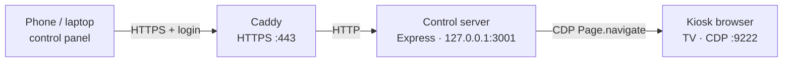

# Planning Center Countdown Kiosk

[](https://github.com/Paperboypaddy/Planning-Center-Timer-Kiosk/actions/workflows/ci.yml)
[](LICENSE)
[](https://nodejs.org/)

Drives the Planning Center Services live/countdown page on a wall TV from a
small computer. Switch services from a phone or laptop on the same network —
no SSH, no keyboard on the TV.

**Platforms:** Linux (Debian/Ubuntu, Raspberry Pi, Orange Pi, x86 Mini PCs),
[NixOS](docs/PLATFORMS.md#nixos-declarative-cagewayland), Windows, and macOS.
See [docs/PLATFORMS.md](docs/PLATFORMS.md) for setup and feature differences.

---

## How it works



> [!NOTE]
> On Windows the Electron app serves HTTPS itself (no Caddy). On every
> platform the TV tab is a **real top-level navigation** via the Chrome
> DevTools Protocol — not an iframe — because Planning Center blocks embedding.

| Piece | Role |
| --- | --- |
| **Control server** (`server/`) | Stores services + config; drives the kiosk over CDP |
| **Control panel** (`public/`) | Mobile-friendly UI — one tap per service |
| **Kiosk launcher** (`kiosk/`) | Chromium/Edge in kiosk mode with a persistent profile |
| **Idle page** (`/nowplaying`) | What the TV shows when nothing is selected |

### Why CDP instead of an iframe?

Planning Center sends `X-Frame-Options` / CSP that block embedding. Navigating
the real browser tab via CDP sidesteps that entirely.

### Logging in to Planning Center

The TV has no keyboard, so the panel includes a **remote control**: it streams
the kiosk tab (screencast) and forwards taps/keystrokes. Tap **Start remote
control**, log in once (including 2FA on your phone), and the session cookie
lives in the kiosk's persistent profile across reboots.

> [!TIP]
> This is a one-time setup. Do not automate PCO credentials — use the real
> login flow so 2FA/SSO work normally.

---

## Quick start (development)

Requires Node.js ≥ 18 and a Chromium-based browser.

```bash
npm install
npm start                 # http://127.0.0.1:3001
npm test                  # no browser or network needed
```

Simulate the kiosk in another terminal:

```bash
chromium --kiosk --remote-debugging-port=9222 \
  --user-data-dir="$HOME/.config/kiosk-chromium" \
  http://127.0.0.1:3001/nowplaying
```

Add a service in the panel, tap it, and the kiosk navigates to
`https://services.planningcenteronline.com/live/<planId>`.

---

## Install on a device

| Platform | Command / build |
| --- | --- |
| **Linux** | `sudo ./kiosk/install.sh` |
| **NixOS** | Flake module — see [PLATFORMS.md](docs/PLATFORMS.md#nixos-declarative-cagewayland) |
| **Windows** | `installer\windows\build-windows.ps1` → portable exe + installer |
| **macOS** | `./kiosk/install-macos.sh` |

Full walkthrough: **[docs/SETUP.md](docs/SETUP.md)** · platform matrix:
**[docs/PLATFORMS.md](docs/PLATFORMS.md)** · pilot checklist:
**[docs/DEPLOYMENT.md](docs/DEPLOYMENT.md)**

After install: create the admin account on first panel visit, do the one-time
PCO login via remote control, then add services.

---

## Features

### URL template & display

Each service stores a PCO plan ID (`serviceId`) and optional `displayType`.
The target URL comes from a configurable template (default):

```text
https://services.planningcenteronline.com/live/{serviceId}
```

Tokens: `{serviceId}`, `{displayType}`. Edit under **Settings**. Global
defaults for display type and theme apply on selection (or **Apply to kiosk
now**); per-service display type overrides the default.

Known display types: `Normal Layout` · `Countdown Full` · `Countdown Lower` ·
`Lower Third` · `Fullscreen Overview`. Themes: `light` / `dark`.

### TV power, auto-on, reboot

On Linux with HDMI-CEC (`cec-utils`):

- Manual TV on / off / status from the panel
- **Auto-on** before the next service or rehearsal (needs a PCO API key)
- **Reboot schedule** via simple presets or a 5-field cron expression

### Wi-Fi (Raspberry Pi)

Scan and connect from the panel when NetworkManager (`nmcli`) is available.
Passwords go straight to NetworkManager and are never stored by the kiosk.

### Import from Planning Center

Connect a read-only personal access token (or `app_id:secret`) and pull
upcoming plans into the service list — no manual plan IDs.

<details>
<summary><strong>Configuration & environment</strong></summary>

Config lives in one JSON file (`KIOSK_CONFIG`, default `./config.json`; under
systemd: `/var/lib/kiosk/config.json`):

```json
{
  "urlTemplate": "https://services.planningcenteronline.com/live/{serviceId}",
  "activeServiceId": null,
  "defaultDisplayType": null,
  "defaultTheme": null,
  "tv": { "autoOn": false, "leadMinutes": 30 },
  "reboot": { "cron": null },
  "services": [
    { "id": "…", "name": "Sunday 9am", "serviceId": "90197325", "displayType": "", "serviceTypeId": "…" }
  ],
  "pco": { "apiKey": null }
}
```

| Env var | Default | Purpose |
| --- | --- | --- |
| `KIOSK_PORT` | `3001` | Control-server port (localhost) |
| `KIOSK_PANEL_PORT` | `443` | HTTPS panel port (Caddy / installers) |
| `KIOSK_CONFIG` | `./config.json` | Config file path |
| `KIOSK_CDP_HOST` | `127.0.0.1` | Chromium CDP host |
| `KIOSK_CDP_PORT` | `9222` | Chromium remote-debugging port |
| `KIOSK_PCO_API_KEY` | — | PCO token; overrides config-file key |

</details>

<details>
<summary><strong>REST API</strong></summary>

| Method | Path | Purpose |
| --- | --- | --- |
| `GET` | `/api/state` | Full state |
| `GET` | `/api/health` | Liveness + kiosk connection |
| `PUT` | `/api/settings` | `{urlTemplate?, defaultDisplayType?, defaultTheme?}` |
| `POST` | `/api/kiosk/settings/apply` | Apply defaults to the current page |
| `POST` | `/api/kiosk/display-type` | Set display type on the kiosk now |
| `GET` / `POST` | `/api/tv/status` · `/on` · `/off` | HDMI-CEC TV power |
| `POST` / `PUT` / `DELETE` | `/api/services` · `/:id` | Manage services |
| `POST` | `/api/select` · `/api/deselect` | Switch TV / return to idle |
| `GET` / `PUT` / `POST` | `/api/pco/*` | Status, key, plans, import |
| `GET` / `POST` | `/api/wifi/*` | Status, scan, connect (SBCs) |
| `GET` | `/api/update/progress` | Update progress (public across restarts) |
| `POST` / `GET` | `/api/remote/*` | Screencast start/stop/input + SSE stream |

`POST /api/select` returns `skipped: true` when already on that URL, and `502`
when the kiosk is unreachable (selection is still saved; the TV catches up on
reconnect).

</details>

---

## Resilience

- **Browser crash** — systemd (or the tray/supervisor) restarts Chromium with
  the same profile; the server reconnects over CDP and re-navigates.
- **Server restart** — state reloads from `config.json`; the kiosk re-syncs on
  the next CDP connect.
- **Reconnect loop** — if Chromium is down, the server retries every ~5s.

---

## Continuous integration & updates

CI (`.github/workflows/ci.yml`) runs tests, Nix flake checks, a Windows build,
and a source tarball on every push/PR.

Releases are **manual** from the GitHub Releases page:

| Kind | Tag example | Notes |
| --- | --- | --- |
| Stable | `2026.8.4` | Shown to all panels |
| Beta | `2026.8.5-beta` | Opt-in via **Include prereleases** |

> [!IMPORTANT]
> Bump `package.json` and `app/package.json` to match the tag before
> publishing. The updater refuses mismatches as a downgrade guard.

Publishing a release attaches the Windows artifacts, source tarball, and
`checksums.txt`. Linux panels can apply updates in-place; Windows/macOS link
to the release for a manual reinstall. NixOS: bump the flake input and
`nixos-rebuild switch`.

---

## Security

- CDP and the control server bind to **127.0.0.1** only.
- The panel is HTTPS (Caddy or in-server TLS) with **cookie sessions** and a
  first-run admin setup. Loopback (kiosk window) skips auth; LAN clients must
  log in.
- The control user is unprivileged; sudo is limited to reboot (+ update on
  Linux).
- Remote control and the optional PCO API key stay on the trusted LAN; prefer
  `KIOSK_PCO_API_KEY` over storing the key in config when possible.

See [docs/DEPLOYMENT.md](docs/DEPLOYMENT.md) for the full pre-flight checklist.

---

## Docs

| Doc | Contents |
| --- | --- |
| [SETUP.md](docs/SETUP.md) | Install, PCO login, mDNS, troubleshooting |
| [PLATFORMS.md](docs/PLATFORMS.md) | Feature matrix + per-platform packaging |
| [DEPLOYMENT.md](docs/DEPLOYMENT.md) | Security & hardware acceptance checklists |
| [AGENTS.md](AGENTS.md) | Architecture notes for contributors / agents |

## License

[AGPL-3.0](LICENSE)
