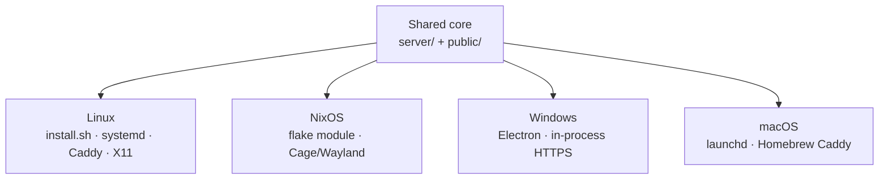

# Platforms

The control software is the same everywhere: Node + a Chromium-based browser
over the Chrome DevTools Protocol. Packaging and a few platform-specific
features differ.

Related: [SETUP.md](SETUP.md) · [DEPLOYMENT.md](DEPLOYMENT.md) · [README](../README.md)

---

## Feature matrix

| Feature | Linux (Debian) | NixOS | Windows | macOS |
| --- | :---: | :---: | :---: | :---: |
| Control server + panel | ✅ | ✅ | ✅ | ✅ |
| Kiosk browser (CDP-driven) | ✅ X11 | ✅ Cage/Wayland | ✅ | ✅ |
| Display type / theme | ✅ | ✅ | ✅ | ✅ |
| Remote control / PCO login | ✅ | ✅ | ✅ | ✅ |
| PCO API importer | ✅ | ✅ | ✅ | ✅ |
| Daily reboot schedule | ✅ | ✅ | ✅ | ⚠️ needs privileges |
| TV power (CEC) + auto-on | ✅ | ✅ | ❌[^cec] | ❌ |
| mDNS (`https://hostname.local`) | ✅ avahi | ✅ avahi | ✅ built-in | ✅ Bonjour |
| In-panel software update | ✅ `update.sh` | ❌ use `nixos-rebuild` | download / reinstall | re-run installer |

[^cec]: Windows would need a Pulse-Eight USB-CEC adapter; the panel hides the
section when `cec-client` is missing. Auto-on depends on CEC, so it is off on
Windows/macOS too.



---

## Linux (Raspberry Pi OS / Debian / Ubuntu)

Primary, best-tested target — arm64 and amd64.

```bash
sudo ./kiosk/install.sh
```

Installs packages, the X/lightdm kiosk session, the control server, Caddy
(HTTPS on :443), and optionally Tailscale. See [SETUP.md](SETUP.md).

---

## NixOS (declarative, Cage/Wayland)

Enable the module and the machine boots into the kiosk: Cage on tty1 →
Chromium, control server, Caddy TLS panel.

**Releases:** pin a published GitHub release tag (same tags as Windows/Linux).
There is no separate Nix binary — the tag *is* the flake ref. CI runs
`nix flake check` on `x86_64-linux` and `aarch64-linux` for every PR, push to
`main`, and published release.

```nix
{
  # Prefer a release tag in production:
  inputs.kiosk.url = "github:Paperboypaddy/Planning-Center-Timer-Kiosk/2026.8.5";
  # Or follow main while developing:
  # inputs.kiosk.url = "github:Paperboypaddy/Planning-Center-Timer-Kiosk";

  outputs = { nixpkgs, kiosk, ... }: {
    nixosConfigurations.my-kiosk = nixpkgs.lib.nixosSystem {
      system = "x86_64-linux"; # or aarch64-linux
      modules = [
        kiosk.nixosModules.default
        {
          services.planningcenter-timer-kiosk.enable = true;
        }
      ];
    };
  };
}
```

See [`nix/example-configuration.nix`](../nix/example-configuration.nix).

| | |
| --- | --- |
| State | `/var/lib/planningcenter-timer-kiosk` |
| Admin | Create on first panel visit (`https://<hostname>.local`) |
| Updates | Bump the flake input → `nixos-rebuild switch` (not the panel button) |

Packaging under `nix/` is shaped for a future nixpkgs PR (`package.nix` +
module).

---

## Windows (Mini PC / laptop)

A **single-file Electron app** (`Planning Center Kiosk.exe`): control server
in-process with HTTPS on `:443` (no Caddy), fullscreen kiosk window driven by
the same CDP logic, and a **system tray**:

| Tray action | Effect |
| --- | --- |
| **Start / Stop kiosk** | Show or hide the kiosk window (panel stays reachable) |
| **Open control panel** | Opens `https://<hostname>.local` (also on double-click) |
| **Quit** | Stop everything and exit |

First run generates a self-signed cert under
`%APPDATA%\Planning Center Kiosk`. Create the admin account on the panel.
Single-instance, restart-on-crash logging to `kiosk.log`, always non-elevated
(avoids the admin-owned profile bug that broke Edge).

### Build

Needs Node ≥ 18 and Inno Setup 6 (`ISCC` on PATH or set explicitly):

```powershell
$env:ISCC = "C:\Program Files (x86)\Inno Setup 6\ISCC.exe"
powershell -ExecutionPolicy Bypass -File installer\windows\build-windows.ps1
```

| Output | Description |
| --- | --- |
| `app\dist\Planning-Center-Kiosk-<version>.exe` | Portable single-file app (~150–200 MB) |
| `installer\windows\output\KioskSetup.exe` | Slim installer (Program Files, shortcuts, firewall for :443) |

For an unattended kiosk, enable Windows **autologon** so the box boots into
the session that runs the Startup shortcut.

---

## macOS (best-effort)

```bash
./kiosk/install-macos.sh
```

Installs Node + Caddy via Homebrew, copies the app to
`/usr/local/planningcenter-kiosk`, generates a self-signed cert, installs a
launchd agent that keeps `kiosk/run.js` (server + Caddy + browser) alive in
your GUI session, and adds a **Kiosk Control panel** app under `/Applications`.
Allow Caddy in the firewall when prompted.

> [!NOTE]
> The daily-reboot schedule needs elevated privileges, so it is best-effort
> from a user agent.
